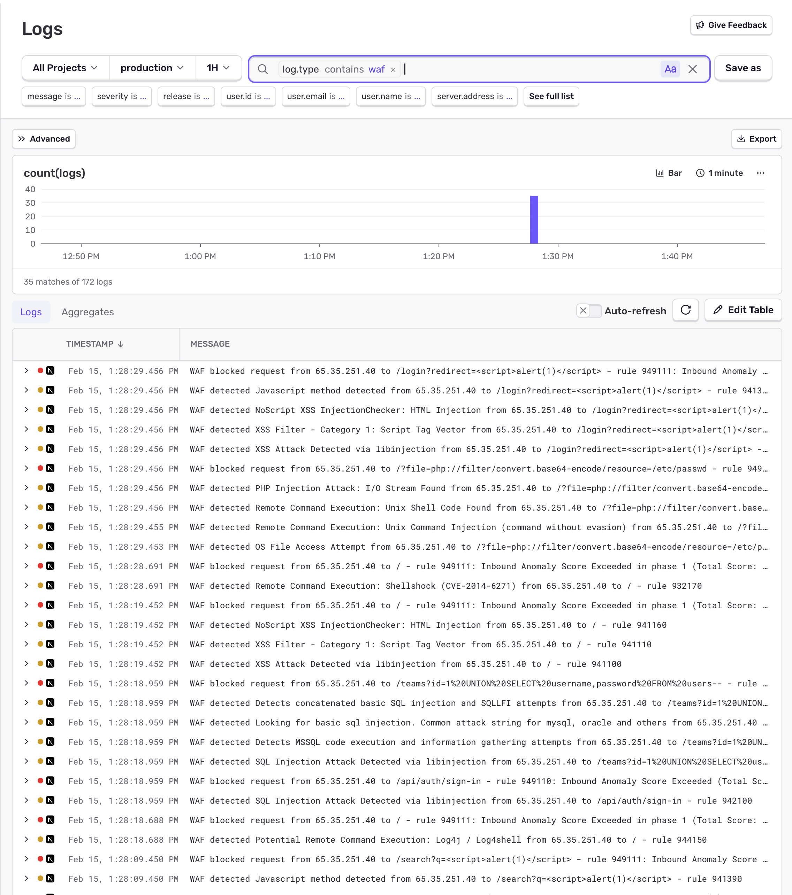
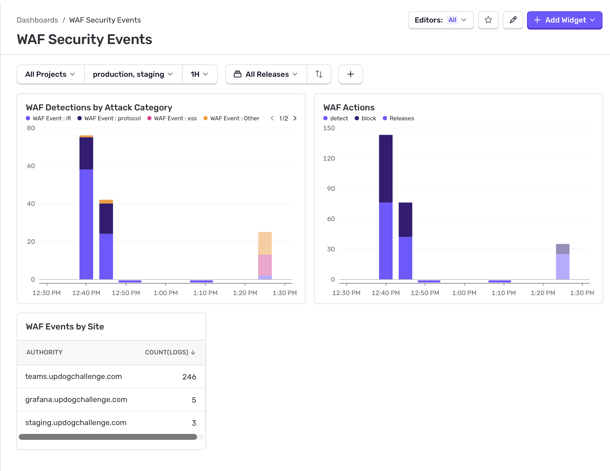

# coraza-sentry-log-forwarder

Forward [Coraza WAF](https://coraza.io/) events from [Envoy Gateway](https://gateway.envoyproxy.io/) pods to [Sentry Structured Logs](https://docs.sentry.io/product/explore/logs/).

Runs as a lightweight log collector in your Kubernetes cluster, tailing Envoy container logs via the Kubernetes API for Coraza WAF output, parsing the events, enriching them with access log data (hostname, environment), and forwarding them to Sentry as structured log entries.

## Screenshots

### Sentry Logs View

Filter WAF events in Sentry's Logs explorer using `log.type contains waf`:



### Custom Dashboard

Build dashboards to visualize WAF detections by attack category, block vs detect actions, and events by site:



## How It Works

1. **Pod discovery** — Watches the Kubernetes API for pods matching a label selector (defaults to any Envoy Gateway pod). Automatically picks up new pods and cleans up when pods are removed.

2. **Log streaming** — Opens a follow stream on each pod's container logs via the Kubernetes log API. Reconnects with exponential backoff on failures.

3. **Coraza log parsing** — Detects Coraza WAF log lines (containing `coraza-waf`) and extracts structured fields: rule ID, message, client IP, URI, hostname, severity, matched data, CRS version, and action (detect vs. block).

4. **Access log correlation** — Buffers WAF events briefly (10s) and attempts to match them with subsequent JSON access log lines from Envoy. This enriches events with the `:authority` header (hostname) and maps it to a Sentry environment.

5. **Sentry forwarding** — Sends enriched events to Sentry as structured logs. Blocked requests are logged at `error` level; detections at `warn` level. Each log includes all parsed fields as attributes.

## Prerequisites

- Kubernetes cluster with [Envoy Gateway](https://gateway.envoyproxy.io/)
- [Coraza WAF](https://coraza.io/) configured as an Envoy filter (via `SecurityPolicy` or WASM filter)
- Envoy access logging enabled in JSON format
- A [Sentry](https://sentry.io/) project with Structured Logs enabled (optional — falls back to stdout)

## Environment Variables

| Variable | Required | Default | Description |
|----------|----------|---------|-------------|
| `SENTRY_DSN` | No | — | Sentry DSN. If not set, events are logged to stdout as JSON. |
| `POD_NAMESPACE` | No | `envoy-gateway-system` | Kubernetes namespace to watch for Envoy pods. |
| `POD_LABEL_SELECTOR` | No | `gateway.envoyproxy.io/owning-gateway-name` | Label selector to find Envoy pods. |
| `CONTAINER_NAME` | No | `envoy` | Container name to tail logs from. |
| `HOSTNAME_ENVIRONMENT_MAP` | No | `{}` | JSON mapping of hostnames to Sentry environments. |
| `SENTRY_ENVIRONMENT` | No | — | Fallback Sentry environment when hostname map doesn't match. |
| `BUILD_ID` | No | `development` | Used as the Sentry release identifier. |

### Hostname-to-Environment Mapping

The `HOSTNAME_ENVIRONMENT_MAP` variable lets you attribute WAF events to different Sentry environments based on which hostname was targeted:

```bash
HOSTNAME_ENVIRONMENT_MAP='{"staging.example.com":"staging","app.example.com":"production"}'
```

When a WAF event is correlated with an access log entry, the `:authority` header (hostname) is looked up in this map. The resolved environment is set as `sentry.environment` on the log entry, so events appear under the correct environment in Sentry.

**Fallback order:**
1. Hostname match from `HOSTNAME_ENVIRONMENT_MAP`
2. `SENTRY_ENVIRONMENT` env var (applies to all events without a hostname match)
3. Omitted (no environment set)

## Kubernetes Deployment

Apply the example manifest which includes RBAC (ServiceAccount, Role, RoleBinding) and a Deployment:

```bash
# Review and customize the manifest first
kubectl apply -f deploy/kubernetes/deployment.yaml
```

The manifest uses `envoy-gateway-system` as the namespace. Adjust if your Envoy Gateway runs in a different namespace.

**Customize before deploying:**
- Set `SENTRY_DSN` to your project's DSN
- Set `POD_LABEL_SELECTOR` to match your gateway name (e.g. `gateway.envoyproxy.io/owning-gateway-name=my-gateway`)
- Update the container image to your registry
- Optionally set `HOSTNAME_ENVIRONMENT_MAP` and `SENTRY_ENVIRONMENT`

## Container Image

Pre-built multi-arch images (linux/amd64, linux/arm64) are available on GitHub Container Registry:

```
ghcr.io/bbatchelder/coraza-sentry-log-forwarder
```

```bash
# Run (requires kubeconfig mounted)
docker run \
  -e SENTRY_DSN=https://your-dsn@sentry.io/12345 \
  -e HOSTNAME_ENVIRONMENT_MAP='{"app.example.com":"production"}' \
  -v ~/.kube:/home/tailer/.kube:ro \
  ghcr.io/bbatchelder/coraza-sentry-log-forwarder:latest
```

## Building from Source

```bash
git clone https://github.com/bbatchelder/coraza-sentry-log-forwarder.git
cd coraza-sentry-log-forwarder
npm install
npm run build
npm start
```

## Development

```bash
npm install
npm run dev          # Run with tsx (auto-reload)
npm test             # Run tests
npm run test:watch   # Run tests in watch mode
```

## Sentry Log Attributes

Each WAF event is forwarded to Sentry with these attributes:

| Attribute | Type | Description |
|-----------|------|-------------|
| `rule_id` | string | Coraza/CRS rule ID (e.g. `942100`) |
| `rule_msg` | string | Human-readable rule description |
| `client_ip` | string | Source IP address |
| `action` | string | `detect` or `block` |
| `pod` | string | Kubernetes pod name that logged the event |
| `uri` | string | Request URI (if available) |
| `hostname` | string | Target hostname from WAF log (if available) |
| `severity` | string | Rule severity (e.g. `critical`, `warning`) |
| `matched_data` | string | Data that triggered the rule (if available) |
| `crs_version` | string | OWASP CRS version (e.g. `OWASP_CRS/4.14.0`) |
| `authority` | string | `:authority` header from correlated access log |
| `sentry.environment` | string | Resolved environment (from hostname map or fallback) |

## Without Sentry

If `SENTRY_DSN` is not set, the forwarder logs events to stdout as JSON:

```json
{
  "level": "error",
  "message": "WAF blocked request from 1.2.3.4 to /admin - rule 942100: SQL Injection Attack Detected",
  "rule_id": "942100",
  "rule_msg": "SQL Injection Attack Detected",
  "client_ip": "1.2.3.4",
  "action": "block",
  "pod": "envoy-gateway-abc123",
  "uri": "/admin"
}
```

This makes it usable as a general-purpose WAF log parser even without Sentry.

## License

MIT
